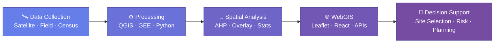

## 🧭 From Data to Decisions

I turn satellite imagery, field surveys, and multi-criteria models into interactive maps and decision-support tools that answer one question — **where**. Where to site a treatment plant, where fire has scarred the land, where risk concentrates as a city grows.

Final-year State Engineer in Geoinformation at FSTT (2023–2026), currently building WebGIS & geomarketing tools during my PFE internship at Orange Morocco. I'm at my best on problems that run the whole pipeline — from raw pixels and shapefiles to a live dashboard someone actually uses to decide.

- 🛰️ **Remote sensing** — automatic burned-area mapping from satellite time series with Google Earth Engine & deep learning
- 📐 **Spatial decision analysis** — AHP-based site suitability, from a wastewater treatment plant (STEPO) to sustainable-tourism zoning
- 🌐 **WebGIS engineering** — full-stack platforms, from PostGIS schema to API to Leaflet/React front end
- 🏙️ **3D & digital twins** — Blender modeling for smart-city and urban-planning scenarios

*📍 Marrakech, Morocco · 🎓 Graduating 2026 · 🟢 Open to GIS, WebGIS & remote-sensing roles*



```yaml
profile:
  name: "Leila Lhannaoui"
  title: "GIS & Geomatics Engineer"
  based_in: "Marrakech, Morocco 🇲🇦"
  education: "State Engineer in Geoinformation — FSTT, Faculté des Sciences et Techniques de Tanger (2023–2026)"
  current: "PFE Internship @ Orange Morocco — WebGIS & Geomarketing"

  focus:
    - "WebGIS platforms & spatial decision-support tools"
    - "Geomarketing & location intelligence"
    - "Remote sensing & Earth observation"
    - "Multi-criteria spatial analysis (AHP)"
    - "3D modeling & digital twins"

  signature_projects:
    - "STEPO — AHP siting of a wastewater treatment plant, Ouazzane"
    - "Burned Area Detection — automated fire-scar mapping via GEE + deep learning"

  languages: ["Arabic (native)", "French (fluent)", "English (C1)"]
  open_to: ["GIS & Geomatics roles", "WebGIS development", "Remote sensing projects"]
```
