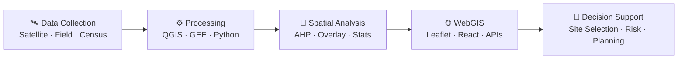

<p align="center">

</p>

<p align="center">
<a href="https://readme-typing-svg.demolab.com/"></a>
</p>

<p align="center">
<a href="https://www.linkedin.com/in/leila-lhannaoui-409b32223"></a>
<a href="mailto:4leilalhannaoui@gmail.com"></a>


</p>

## 🧭 From Data to Decisions

I turn satellite imagery, field data, and multi-criteria models into interactive maps and decision-support tools that answer one question — **where**. Where to build, where risk concentrates, where a city can grow smarter.

Final-year State Engineer in Geoinformation at FSTT (2023–2026), currently building WebGIS & geomarketing tools during my PFE internship at Orange Morocco. I like problems that run the whole pipeline — from raw pixels and shapefiles to a dashboard someone actually uses to decide.

- 🛰️ **Remote sensing** — automatic change detection with Google Earth Engine & deep learning
- 📐 **Spatial decision analysis** — AHP-based site suitability for real infrastructure projects
- 🌐 **WebGIS engineering** — from PostGIS schema to API to Leaflet/React front end
- 🏙️ **3D & digital twins** — Blender modeling for smart-city use cases

*📍 Marrakech, Morocco · 🎓 Graduating 2026 · 🟢 Open to GIS, WebGIS & remote-sensing roles*



```yaml
profile:
  name: "Leila Lhannaoui"
  title: "GIS & Geomatics Engineer"
  based_in: "Marrakech, Morocco 🇲🇦"
  education: "State Engineer in Geoinformation — FSTT, Faculté des Sciences et Techniques de Tanger (2023–2026)"
  current: "PFE Internship @ Orange Morocco — WebGIS & Geomarketing"

  focus:
    - "WebGIS platforms & spatial decision-support tools"
    - "Geomarketing & location intelligence"
    - "Remote sensing & Earth observation"
    - "Multi-criteria spatial analysis (AHP)"
    - "3D modeling & digital twins"

  languages: ["Arabic (native)", "French (fluent)", "English (C1)"]
  open_to: ["GIS & Geomatics roles", "WebGIS development", "Remote sensing projects"]
```

---

## 🛠️ Technical Arsenal

From satellite imagery to interactive web maps — here's the stack behind turning spatial data into decisions.

### 🗺️ GIS & Spatial Analysis
<p align="left">


</p>

- 📐 **Site suitability** — AHP-based multi-criteria analysis, applied to siting a wastewater treatment plant (STEPO, Ouazzane)
- 🧩 **Plugin development** — custom QGIS plugins, including a tourism-sustainability evaluation tool
- 🗺️ **Spatial modeling** — overlay analysis & geoprocessing pipelines in QGIS / ArcGIS Pro

### 🛰️ Remote Sensing & Earth Observation
<p align="left">


</p>

- 🔥 **Change detection** — automatic burned-area mapping, combining remote sensing with deep learning
- 🌉 **Feasibility studies** — large-scale geospatial analysis for the Europe–Africa Bridge study at the Strait of Gibraltar
- 🛰️ **Earth observation** — satellite imagery analysis & processing with Google Earth Engine

### 🌐 WebGIS & Web Development
<p align="left">


</p>

- 🗺️ **Interactive platforms** — spatial decision-support WebGIS, e.g. the Urban Transport WebGIS for Tangier Medina
- 📊 **Geomarketing** — location-intelligence dashboards built during my PFE internship at Orange Morocco
- 🔗 **Backend & deployment** — APIs with Django / FastAPI / PHP, containerized with Docker

### 🏙️ 3D Modeling & Digital Twin
<p align="left">


</p>

- 🏗️ **3D modeling** — assets & environments in Blender for digital-twin use cases

### 💾 Databases & Spatial Data Management
<p align="left">


</p>

- 🗄️ **Spatial databases** — designing & querying the data layer behind WebGIS platforms
- 🔍 **Spatial SQL** — proximity, overlay & topology queries with PostGIS

### 💻 Programming Languages
<p align="left">


</p>

- 🐍 **Python** — geoprocessing automation & desktop GIS tools, e.g. GeoCalc (coordinate conversion & geodetic calculations)
- 📊 **R** — spatial statistics, plus **Java** & **C++** from engineering coursework

---

## 🚀 Featured Projects

A few projects that show the range — from multi-criteria siting to satellite-based change detection.

| | Project | Tools | Highlights |
|:---:|---|---|---|
| 🏭 | **STEPO** | ArcGIS | AHP multi-criteria siting of a wastewater treatment plant, Ouazzane |
| 🧮 | **GeoCalc** | Python | Desktop app for coordinate conversion & geodetic calculations |
| 🔥 | **Burned Area Detection** | Remote Sensing · Deep Learning | Automated mapping of fire-affected surfaces from satellite imagery |
| 🚌 | **Urban Transport WebGIS — Tangier Medina** | PostGIS · Python · Leaflet | Interactive spatial-analysis platform for urban transport planning |
| 🏞️ | **QGIS Plugin — Tourism Sustainability** | QGIS · AHP | Custom multi-criteria evaluation plugin for sustainable tourism |
| 🌉 | **Europe–Africa Bridge Feasibility** | Google Earth Engine | Large-scale feasibility study at the Strait of Gibraltar |

---

## 📊 GitHub Stats

<p align="center">


</p>

<p align="center">

</p>

<p align="center">

</p>

---

## 📫 Let's Connect!

Always glad to talk WebGIS, remote sensing, or spatial decision-support — reach out any time. I'm graduating in 2026 and open to full-time GIS, WebGIS, or geospatial-analysis roles.

<p align="center">
📧 <strong>Email:</strong> <a href="mailto:4leilalhannaoui@gmail.com">4leilalhannaoui@gmail.com</a><br>
💼 <strong>LinkedIn:</strong> <a href="https://www.linkedin.com/in/leila-lhannaoui-409b32223">leila-lhannaoui</a><br>
💻 <strong>GitHub:</strong> <a href="https://github.com/LeilaLHN">LeilaLHN</a>
</p>

---

<p align="center">
<em>🗺️ Always Mapping • 🛰️ Always Observing • 🌍 Always Building Spatial Solutions</em>
</p>

<p align="center">

</p>

<p align="center">

</p>
